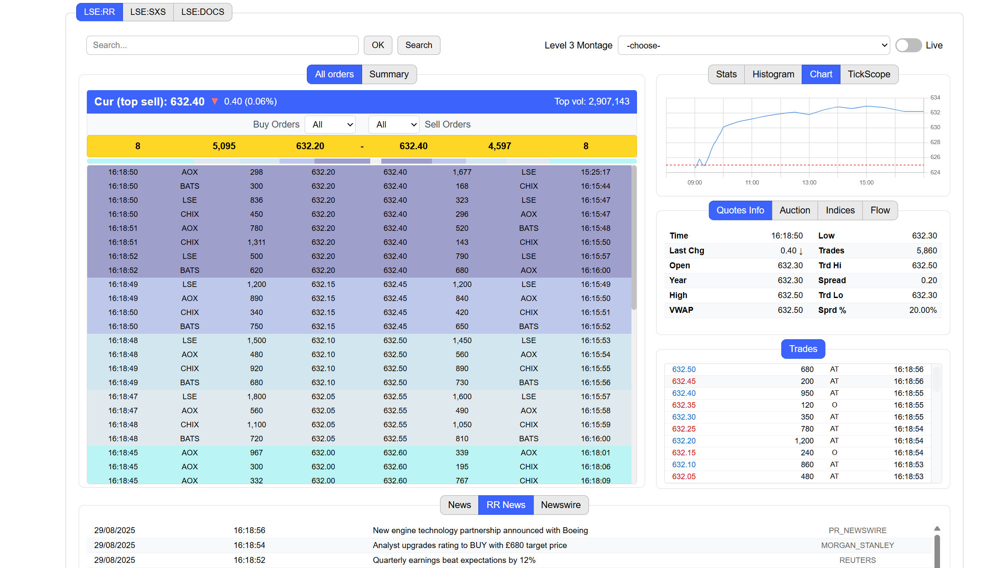
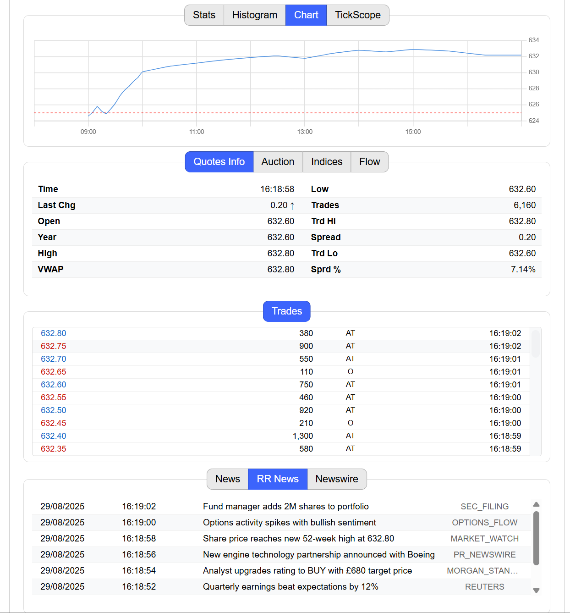
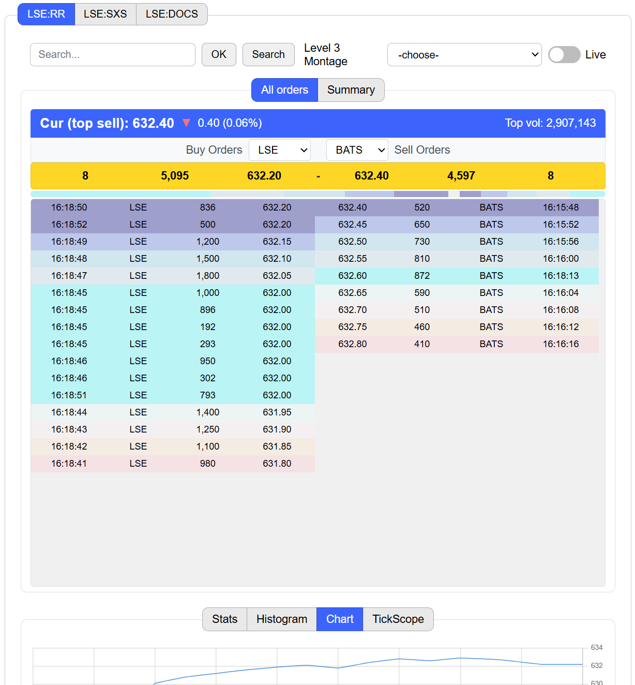

# Mathieu Delehaye - Orderbook Simulation

A real-time orderbook visualization application built with Java Spring Boot and WebSocket.

## 🌐 Live Application

**🚀 [View Live Orderbook](https://orderbook-simulation.onrender.com/)**

> **⏳ Note:** It may take up to 10 seconds to launch if the app is inactive.

## Screenshots

### Desktop Web View


### Responsive Views




## Features

- Real-time orderbook data visualization
- Interactive price level charts
- OHLC data display
- Trade history
- News feed integration
- WebSocket-based live updates

## Technologies

- **Backend**: Java 17, Spring Boot, WebSocket
- **Frontend**: HTML, CSS, JavaScript, Chart.js
- **Build**: Gradle
- **Deployment**: Docker

## Running Locally

1. Clone the repository
2. Run with Gradle: `./gradlew bootRun`
3. Open browser to `http://localhost:8080`

## Docker Deployment

```bash
docker build -t orderbook-simulation .
docker run -p 8080:8080 orderbook-simulation
```
